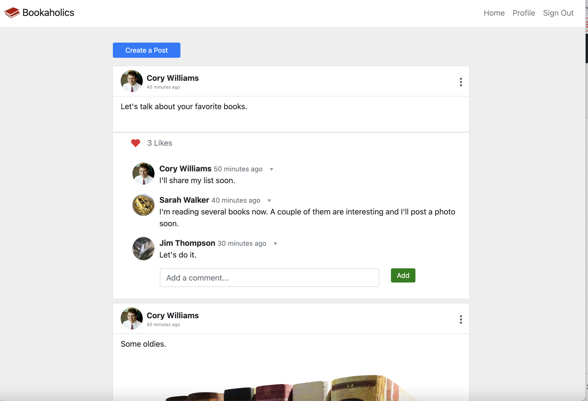

# Bookaholics-Social-Media

## Description

Bookaholics is a social media app where users can share about their favorite books.  The app provides a specific place for people to connect and discuss one thing - their love of books. 

The app allows a user to create posts that are displayed on a homepage feed.  In addition, each user’s posts are shown on their own profile page.  Other users of the site can add comments and likes to the posts they want to interact with when they view the homepage.

Posts can be edited and deleted.

The site features a Sign Up page and Login Page.

## Functionality

When a user visits the site they are presented with a sign in page.  On the navigation header the user can choose to sign up if they do on already have an account.  When the user signs up they are prompted for a username and password.  The user's credentials are saved whereby the user can click on the option to sign into the application with their username and password.  

When the user signs into the application they are presented with homepage feed that contains posts by users of the application.  A user can create their own posts with text and a photo.  Posts by users are shown in chronological order.  Users can like and/or add comments to the posts of others.  The creator of a post can choose to delete or edit their own posts.  Users who add comments to posts can delete those comments.

When the user clicks on the profile option on the navigation header, they are presented with a profile page that shows all of their own posts in chronological order. 

When the user clicks on the logout option in the navigation, they are signed out of the site.

When the site is idle for more than a set time, the user is able to view posts and comments, but is prompted to login if they want to access content in the site.

The project is responsive with both a desktop and mobile layout.

## Code

The application has a folder structure that meets the MVC paradigm.  

The application uses [MySQL2](https://www.npmjs.com/package/mysql2) and [Sequelize](https://www.npmjs.com/package/sequelize) packages to connect the Express.js API to a MySQL database and the [dotenv](https://www.npmjs.com/package/dotenv) package to use environment variables to store sensitive data.

The application uses Node.js and Express.js to create a RESTful API.

The application uses [Cloudinary](https://cloudinary.com/) for uploading photos.

The application includes authentication (express-session and cookies).

The application uses Handlebars.js as the templating engine.

Comments have been applied to the different files in the code to identify each section of code. 

There is a server.js file that starts the application.

Included is a package.json file with the required dependencies, as well as gitignore, node_modules and .DS_Store files.

## Installation

The code for this project can be found on GitHub at: https://github.com/fuuko08/Group-4-Bookaholic-Social-Media/

The site is deployed at: https://bookaholicbootcampselina.herokuapp.com/

## Usage

The following image shows the application's homepage:

## Credits

N/A

## License

Please refer to the license in the repo.

## Contributing

Michael Kerr,
Selina Su,
Cory Williams
